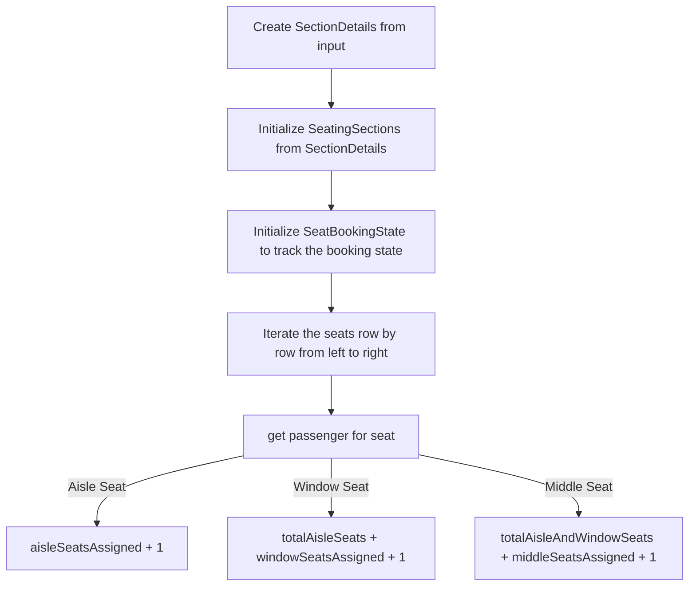

# Airplane Seating

## Workflow




## Build and run

- Restore the packages

```
npm install
```

- To build and run the project

```
npm run build
npm start
```


- To run the tests

```
npm test
```
